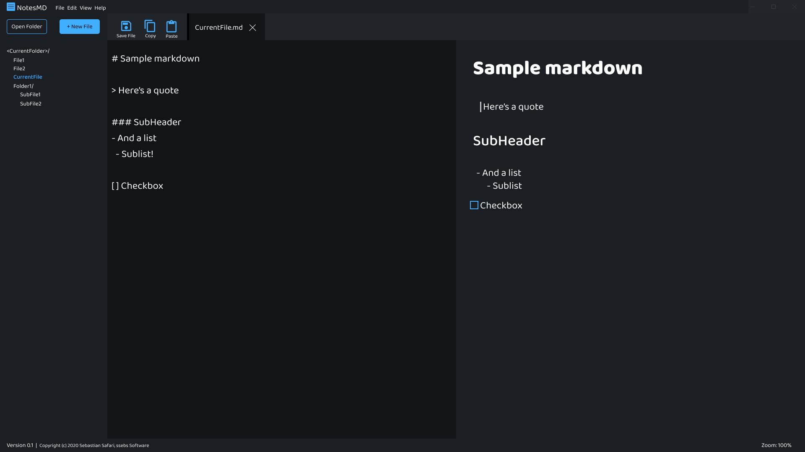

# NotesMD

Structured Note Editor, using Markdown

## Usage
- tbd

## Installation
- tbd

## To do
- [x] Create basic editing wireframes
- [ ] Start Electron project
- [ ] Add MD editing features
- [ ] Create build / release process 
  - [ ] ^ Using CI

## Screenshots
Screenshot of wireframe:

## LICENSE
[MIT](./LICENCE)

